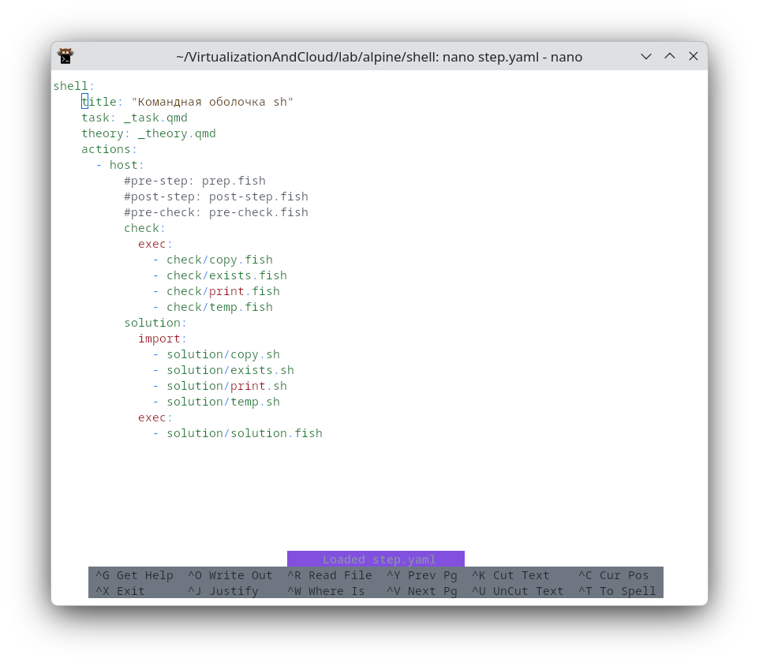

# Текстовый редактор GNU nano {#sec-tools-nano}



**GNU nano** — это небольшой текстовый редактор для терминала, предназначенный прежде всего для быстрого создания и изменения текстовых файлов: заметок, конфигурационных файлов, скриптов и исходного кода. В официальном руководстве nano описывается как “small and friendly text editor”; кроме простого редактирования текста, он поддерживает поиск и замену, переход к строке и столбцу, автоотступы, переключаемые режимы, интернационализацию и автодополнение имён файлов.

Главная особенность nano для начинающего пользователя состоит в том, что это **безрежимный редактор**: при обычном наборе клавиши сразу вводят текст в файл, а не переводят редактор в особый командный режим. Официальное руководство прямо указывает, что все клавиши, кроме сочетаний с `Ctrl` и `Meta`, вводят текст в редактируемый файл.

В нижней части окна nano обычно отображается подсказка с наиболее употребительными командами. Такая организация интерфейса делает редактор удобным в учебной и административной практике: пользователь видит не только текст, но и основные действия, доступные в данный момент. Руководство nano называет эти две нижние строки списком сокращений, где показаны некоторые наиболее часто используемые функции редактора.

## 2. Обозначения клавиш

В документации nano символ `^` означает клавишу **Ctrl**. Например, запись `^X` читается как `Ctrl+X`. Символ `M` или слово `Meta` обычно соответствует клавише **Alt**; если Alt не передаётся терминалом, Meta-команду можно ввести через `Esc`, а затем нужную клавишу. Это соглашение описано в официальном руководстве nano.

Примеры чтения обозначений:

| Обозначение в nano | Как нажимать                 |
| ------------------ | ---------------------------- |
| `^G`               | `Ctrl+G`                     |
| `^O`               | `Ctrl+O`                     |
| `^X`               | `Ctrl+X`                     |
| `M-U`              | `Alt+U` или `Esc`, затем `U` |
| `M-G`              | `Alt+G` или `Esc`, затем `G` |

Это важно усвоить в самом начале: почти все дальнейшие действия в nano выполняются не мышью, а короткими клавиатурными командами.

## 3. Запуск редактора

Наиболее распространённая форма запуска имеет вид:

```bash
nano имя_файла
```

Например:

```bash
nano notes.txt
```

Эта команда открывает файл `notes.txt`. Если такого файла ещё нет, nano создаёт новый буфер с указанным именем; файл будет реально записан на диск после сохранения. Официальный синтаксис запуска nano допускает форму `nano [OPTION]... [FILE]`, а также открытие файла сразу на указанной строке и столбце. ([nano-editor.org][1])

### Пример 1. Создание простой заметки

Выполним команду:

```bash
nano plan.txt
```

После запуска появится рабочая область. Введите текст:

```text
План занятия
1. Повторить команды терминала.
2. Изучить редактор nano.
3. Сохранить файл и выйти.
```

Суть примера состоит в том, что пользователь работает с nano почти как с обычным редактором: вводимый текст сразу помещается в файл. На данном этапе не требуется запоминать сложные режимы работы; достаточно понять три действия: **набор текста**, **сохранение**, **выход**.

## 4. Устройство окна nano

Типичное окно nano можно разделить на четыре смысловые зоны:

1. **Верхняя строка** — строка заголовка. В ней отображаются версия редактора, имя файла или надпись `New Buffer`, а также признак изменения файла, например `Modified`. Руководство nano указывает, что левая часть заголовка показывает версию, центральная — имя файла, а правая может показывать состояние изменения. ([nano-editor.org][1])
2. **Основная область** — место, где находится редактируемый текст.
3. **Строка состояния** — область для сообщений, вопросов и ввода служебных данных, например имени файла при сохранении или строки поиска. Руководство описывает её как место для важных сообщений, ошибок, вопросов и пользовательского ввода. ([nano-editor.org][1])
4. **Нижние подсказки** — список наиболее полезных сочетаний клавиш.

Практическое значение такого устройства состоит в том, что nano постоянно сообщает пользователю, что происходит: изменён ли файл, какую команду редактор ожидает, какой текст нужно ввести в строку поиска или каким именем сохранить файл.

## 5. Сохранение файла

Самое важное действие после ввода текста — сохранение. В современном nano для сохранения текущего файла используется `Ctrl+S`, а для команды “записать файл как” — `Ctrl+O`. Официальная таблица сочетаний nano указывает: `Ctrl+S` сохраняет текущий файл, `Ctrl+O` предлагает записать файл, а `Ctrl+X` закрывает буфер или выходит из nano. ([nano-editor.org][2])

На практике часто используется классическая последовательность:

```text
Ctrl+O
Enter
```

`Ctrl+O` открывает команду записи файла. Затем nano показывает имя файла в строке состояния. Если имя менять не нужно, нажмите `Enter`.

### Пример 2. Сохранение заметки

Пусть в файле `plan.txt` набран следующий текст:

```text
План занятия
1. Повторить команды терминала.
2. Изучить редактор nano.
3. Сохранить файл и выйти.
```

Нажмите:

```text
Ctrl+O
Enter
```

Смысл этого примера — отделить **редактирование буфера** от **записи файла на диск**. Пока текст только набран, он находится в памяти редактора. После `Ctrl+O` и подтверждения имени файла содержимое сохраняется как обычный файл файловой системы.

## 6. Выход из редактора

Для выхода используется:

```text
Ctrl+X
```

Если файл не изменялся после последнего сохранения, nano завершит работу сразу. Если изменения есть, редактор задаст вопрос о сохранении. В этом случае обычно выбирают один из вариантов:

| Действие | Назначение                                  |
| -------- | ------------------------------------------- |
| `Y`      | сохранить изменения                         |
| `N`      | выйти без сохранения                        |
| `Ctrl+C` | отменить выход и вернуться к редактированию |

Команда `Ctrl+X` официально описана как закрытие текущего буфера или выход из nano. ([nano-editor.org][2])

### Пример 3. Безопасный выход

Предположим, пользователь исправил строку, но не уверен, нужно ли сохранять результат. Он нажимает:

```text
Ctrl+X
```

nano спрашивает, сохранять ли изменённый буфер. Если нажать `N`, изменения будут потеряны. Если нажать `Y`, nano предложит подтвердить имя файла. Суть примера — показать, что nano защищает пользователя от случайной потери данных: при наличии несохранённых изменений редактор не закрывается молча.

## 7. Перемещение по тексту

В простейшем случае перемещение выполняется стрелками. Кроме того, nano поддерживает клавиатурные команды для быстрого перехода:

| Действие           | Сочетание |
| ------------------ | --------- |
| На символ влево    | `←`       |
| На символ вправо   | `→`       |
| В начало строки    | `Ctrl+A`  |
| В конец строки     | `Ctrl+E`  |
| На строку вверх    | `Ctrl+P`  |
| На строку вниз     | `Ctrl+N`  |
| На страницу вверх  | `Ctrl+Y`  |
| На страницу вниз   | `Ctrl+V`  |
| В начало буфера    | `Alt+\`   |
| В конец буфера     | `Alt+/`   |
| К указанной строке | `Alt+G`   |

Эти сочетания приведены в официальной таблице быстрых клавиш nano. ([nano-editor.org][2])

### Пример 4. Переход к ошибочной строке

Пусть в файле есть список:

```text
1. Установить пакет.
2. Настроить конфигурацию.
3. Перезапустить службу.
4. Проверить журнал ошибок.
```

Если нужно быстро перейти к четвёртому пункту, можно нажать:

```text
Alt+G
```

Затем ввести номер строки:

```text
4
```

и нажать `Enter`.

Суть примера в том, что перемещение стрелками удобно в коротком тексте, но в длинном конфигурационном файле или программе эффективнее переходить сразу к нужной строке. Это особенно полезно, когда компилятор, интерпретатор или журнал ошибок сообщает конкретный номер строки.

## 8. Удаление, вырезание и вставка

Для удаления отдельных символов используются обычные клавиши `Backspace` и `Delete`. Для работы со строками чаще применяются команды nano:

| Действие                             | Сочетание |
| ------------------------------------ | --------- |
| Вырезать текущую строку              | `Ctrl+K`  |
| Вставить содержимое буфера вырезания | `Ctrl+U`  |
| Скопировать текущую строку           | `Alt+6`   |
| Отменить последнее действие          | `Alt+U`   |
| Повторить отменённое действие        | `Alt+E`   |

Официальная таблица nano указывает, что `Ctrl+K` вырезает текущую строку в буфер вырезания, `Ctrl+U` вставляет содержимое этого буфера, `Alt+6` копирует текущую строку, `Alt+U` отменяет действие, а `Alt+E` повторяет отменённое. ([nano-editor.org][2])

### Пример 5. Перестановка строк

Исходный текст:

```text
Запустить службу.
Изменить конфигурацию.
Проверить результат.
```

Логически сначала нужно изменить конфигурацию, затем запустить службу. Поставьте курсор на строку:

```text
Запустить службу.
```

Нажмите:

```text
Ctrl+K
```

Строка исчезнет и попадёт во внутренний буфер nano. Затем перейдите ниже строки:

```text
Изменить конфигурацию.
```

и нажмите:

```text
Ctrl+U
```

Результат:

```text
Изменить конфигурацию.
Запустить службу.
Проверить результат.
```

Суть примера состоит в том, что `Ctrl+K` в nano часто используется не только как удаление, но и как средство перемещения строк. Команда вырезает строку, а `Ctrl+U` возвращает её в новое место.

## 9. Поиск текста

Для поиска в современных версиях nano используются:

| Действие                    | Сочетание |
| --------------------------- | --------- |
| Поиск вперёд                | `Ctrl+F`  |
| Поиск назад                 | `Ctrl+B`  |
| Следующее совпадение вперёд | `Alt+F`   |
| Следующее совпадение назад  | `Alt+B`   |

Эти команды указаны в официальном обзоре сочетаний nano. ([nano-editor.org][2])

### Пример 6. Поиск параметра в конфигурационном файле

Откроем условный файл:

```bash
nano app.conf
```

Внутри файла может быть много строк:

```text
host = localhost
port = 8080
debug = false
log_level = info
```

Чтобы найти параметр `debug`, нажмите:

```text
Ctrl+F
```

Введите:

```text
debug
```

и нажмите `Enter`.

Суть примера заключается в том, что поиск превращает редактирование длинного файла из линейного просмотра в адресное обращение к нужному фрагменту. В административной работе это особенно важно: конфигурационные файлы часто содержат десятки и сотни строк.

## 10. Замена текста

Для запуска сеанса замены используется:

```text
Alt+R
```

Официальная таблица сочетаний nano описывает `Alt+R` как начало сеанса замены. ([nano-editor.org][2])

### Пример 7. Замена значения параметра

Пусть файл содержит строку:

```text
debug = true
```

Нужно заменить `true` на `false`. Последовательность действий:

```text
Alt+R
```

В строке поиска введите:

```text
true
```

Затем в строке замены:

```text
false
```

После этого nano будет предлагать подтвердить замену найденного совпадения.

Суть примера в том, что замена — более контролируемая операция, чем ручное редактирование каждого совпадения. Она особенно полезна, когда одинаковое слово или параметр встречается несколько раз, но пользователь должен решать, заменять ли каждое конкретное вхождение.

## 11. Выделение фрагмента

В nano выделение называется установкой **метки**. Для включения или отключения метки используется:

```text
Alt+A
```

Официальная таблица сочетаний указывает `Alt+A` как команду установки или снятия метки. ([nano-editor.org][2])

После установки метки перемещайте курсор стрелками или командами навигации. Текст между исходной позицией и текущим положением курсора будет выделен. Затем с выделенным фрагментом можно выполнить действие, например вырезать его через `Ctrl+K`.

### Пример 8. Вырезание абзаца

Исходный текст:

```text
Раздел 1.
Этот абзац нужно оставить.

Раздел 2.
Этот абзац нужно перенести.
Он состоит из двух строк.

Раздел 3.
Этот абзац завершает документ.
```

Поставьте курсор перед строкой:

```text
Этот абзац нужно перенести.
```

Нажмите:

```text
Alt+A
```

Затем переместите курсор до конца строки:

```text
Он состоит из двух строк.
```

Нажмите:

```text
Ctrl+K
```

Выделенный фрагмент будет вырезан. Теперь его можно вставить в другое место через:

```text
Ctrl+U
```

Суть примера состоит в переходе от работы со строкой к работе с областью текста. Это необходимо, когда редактируется не отдельная строка, а связанный смысловой блок.

## 12. Отмена и повтор действия

Ошибочное действие можно отменить:

```text
Alt+U
```

Отменённое действие можно вернуть:

```text
Alt+E
```

Обе команды приведены в официальной таблице быстрых клавиш nano. ([nano-editor.org][2])

### Пример 9. Исправление случайного удаления

Пользователь случайно нажал `Ctrl+K` и удалил важную строку. Вместо того чтобы перепечатывать её вручную, достаточно нажать:

```text
Alt+U
```

Если после отмены стало ясно, что удаление всё же было правильным, можно нажать:

```text
Alt+E
```

Суть примера — показать, что редактирование должно быть обратимым. Команды отмены и повтора позволяют экспериментировать с текстом без постоянного риска необратимой ошибки.

## 13. Вставка другого файла

Команда:

```text
Ctrl+R
```

вставляет содержимое другого файла в текущий. Официальная таблица nano описывает `Ctrl+R` как вставку файла в текущий документ. ([nano-editor.org][2])

### Пример 10. Сборка документа из двух файлов

Пусть есть файл `header.txt`:

```text
Отчёт по лабораторной работе
Автор: Иванов И.И.
```

И открыт файл `report.txt`. Чтобы вставить `header.txt` в начало отчёта, поставьте курсор в начало файла `report.txt`, нажмите:

```text
Ctrl+R
```

Введите имя файла:

```text
header.txt
```

и подтвердите `Enter`.

Суть примера состоит в том, что nano может использоваться не только для ручного набора, но и для простого объединения текстовых фрагментов. Это полезно при подготовке отчётов, шаблонов писем, комментариев к заданиям и небольших документов.

## 14. Работа с несколькими файлами

nano может открывать несколько файлов и переключаться между буферами. В официальном синтаксисе запуска допускается указание нескольких файлов, а в таблице сочетаний приведены команды переключения: `Alt+←` — к предыдущему буферу, `Alt+→` — к следующему. ([nano-editor.org][1])

Пример запуска:

```bash
nano first.txt second.txt
```

После этого можно редактировать один файл, затем перейти к другому через:

```text
Alt+→
```

или вернуться назад через:

```text
Alt+←
```

### Пример 11. Сравнение двух конфигураций

Пусть нужно перенести один параметр из старого файла в новый:

```bash
nano old.conf new.conf
```

В файле `old.conf` найдите нужную строку, скопируйте её через:

```text
Alt+6
```

Переключитесь в следующий буфер:

```text
Alt+→
```

Вставьте строку:

```text
Ctrl+U
```

Суть примера — показать, что несколько буферов позволяют не выходить из редактора при работе с близкими по смыслу файлами. Это удобно, когда один файл служит источником, а другой — местом редактирования.

## 15. Просмотр позиции курсора и номеров строк

Для вывода позиции курсора используется:

```text
Ctrl+C
```

Для включения или отключения номеров строк:

```text
Alt+N
```

Официальная таблица nano указывает `Ctrl+C` как команду сообщения позиции курсора, а `Alt+N` — как включение или выключение номеров строк. ([nano-editor.org][2])

### Пример 12. Поиск ошибки по номеру строки

Предположим, интерпретатор сообщает:

```text
Ошибка в строке 27
```

В nano можно нажать:

```text
Alt+G
```

ввести:

```text
27
```

и перейти прямо к нужной строке. Затем полезно включить номера строк:

```text
Alt+N
```

Суть примера заключается в связи редактора с внешними инструментами. Ошибка часто возникает не “где-то в тексте”, а в конкретной строке. Поэтому переход к строке и отображение номеров превращают nano в практичный инструмент работы с кодом и конфигурациями.

## 16. Встроенная справка

Для вызова справки используется:

```text
Ctrl+G
```

Официальное руководство сообщает, что встроенная справочная система nano доступна по `^G`, перемещение в ней выполняется через `^Y` и `^V`, а выход — через `^X`. ([nano-editor.org][1])

### Пример 13. Самостоятельное уточнение команды

Пользователь забыл, как выполнить замену текста. Вместо выхода из редактора он нажимает:

```text
Ctrl+G
```

Затем просматривает справку и находит нужную команду. После этого выходит из справки:

```text
Ctrl+X
```

Суть примера в том, что nano содержит учебный механизм внутри самого редактора. Это особенно важно для начинающих: справку можно открыть, не покидая редактируемый файл.

## 17. Наиболее употребительные команды nano

Ниже приведён минимальный набор команд, достаточный для повседневной работы:

| Задача                              | Команда                              |
| ----------------------------------- | ------------------------------------ |
| Открыть или создать файл            | `nano имя_файла`                     |
| Сохранить файл                      | `Ctrl+S` или `Ctrl+O`, затем `Enter` |
| Выйти                               | `Ctrl+X`                             |
| Вызвать справку                     | `Ctrl+G`                             |
| Найти текст                         | `Ctrl+F`                             |
| Заменить текст                      | `Alt+R`                              |
| Вырезать строку                     | `Ctrl+K`                             |
| Вставить вырезанное                 | `Ctrl+U`                             |
| Скопировать строку                  | `Alt+6`                              |
| Отменить действие                   | `Alt+U`                              |
| Повторить действие                  | `Alt+E`                              |
| Перейти к строке                    | `Alt+G`                              |
| Показать позицию курсора            | `Ctrl+C`                             |
| Включить или отключить номера строк | `Alt+N`                              |

Этот набор основан на официальной таблице сочетаний клавиш nano и отражает именно наиболее распространённую функциональность: открытие, редактирование, сохранение, поиск, перемещение, копирование, вставку и справку. ([nano-editor.org][2])

## 18. Учебный итоговый пример

Рассмотрим типовую задачу: нужно открыть конфигурационный файл, найти параметр, изменить его, сохранить файл и выйти.

Откроем файл:

```bash
nano server.conf
```

Фрагмент файла:

```text
host = 127.0.0.1
port = 8080
debug = true
log_level = info
```

Нужно отключить режим отладки. Последовательность действий:

1. Найти параметр:

```text
Ctrl+F
debug
Enter
```

2. Изменить строку:

```text
debug = false
```

3. Сохранить файл:

```text
Ctrl+O
Enter
```

4. Выйти:

```text
Ctrl+X
```

Суть этого примера состоит в объединении базовых операций в законченную рабочую процедуру. Сначала пользователь открывает файл, затем находит нужное место, изменяет значение, фиксирует результат на диске и завершает работу. Именно такая последовательность чаще всего встречается при системном администрировании, работе с учебными заданиями и редактировании небольших программ.

## Заключение

GNU nano следует рассматривать как простой, предсказуемый и методически удобный терминальный редактор. Его основная ценность заключается не в избыточном наборе сложных функций, а в том, что наиболее важные операции доступны через короткие сочетания клавиш и постоянно подсказываются в нижней части экрана. Для уверенной повседневной работы достаточно освоить открытие файла, ввод текста, сохранение, выход, поиск, замену, вырезание, вставку, отмену действия и переход к строке. Эти операции образуют практический минимум, после которого пользователь может постепенно переходить к более сложным возможностям nano.

[1]: https://www.nano-editor.org/dist/v2.2/nano.html "nano Command Manual"
[2]: https://www.nano-editor.org/dist/latest/cheatsheet.html "Cheatsheet for GNU nano"
